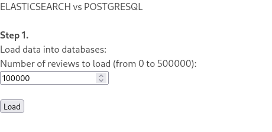
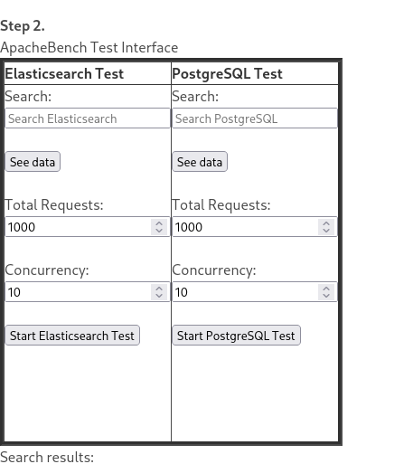
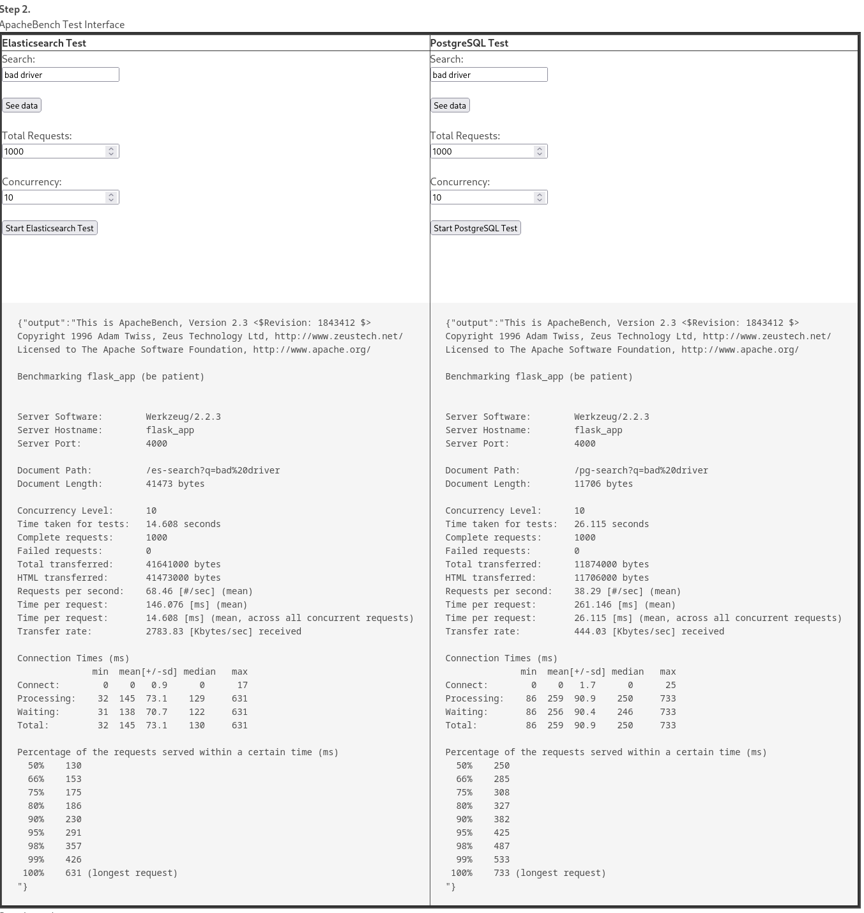
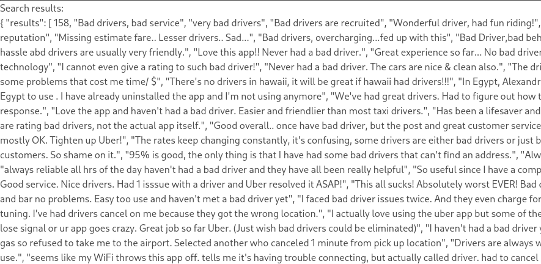

# Full-text search engine (Elasticsearch) vs relational DB (PostgreSQL): find titles of all documents that contain a word

This repository contains a small Flask application that compares the performance of a full-text search engine like Elasticsearch with a relational database like PostgreSQL.

Techology used:
- [**Flask**](https://flask.palletsprojects.com/en/3.0.x/): lightweight and flexible web application framework for Python
- [**Htmx**](https://htmx.org/): a modern web development tool that allows you to access AJAX, CSS Transitions, WebSockets, and server-sent events directly in HTML, using attributes
- [**PostgreSQL**](https://www.postgresql.org/): open-source, advanced object-relational database management system (DBMS)
- [**Elasticsearch**](https://www.elastic.co/elasticsearch): powerful, open-source, distributed search and analytics engine designed for horizontal scalability, reliability, and easy management. It enables complex search capabilities across diverse types of data, and is widely used for log and event data analysis and full-text search
- [**Docker**](https://www.docker.com/): open-source platform that automates the deployment, scaling, and management of applications inside lightweight, portable containers
- [**Apache Bench**](https://httpd.apache.org/docs/2.4/programs/ab.html): a tool for benchmarking the performance of HTTP web servers


## Application instructions

Firstly, you need to clone this repository into an empty folder on your machine:
```shell
git clone 
```

Then, you can build and start Docker containers with:
```shell
sudo docker-compose up --build
```

All application dependencies are installed inside the containers and can be found in the 'requirements.txt' file.

After executing the previous command, all Docker containers should start. **NOTE**: It is advised to only test the application after all containers are ready. Specifically, the **Elasticsearch container takes the longest to start**, so wait for it before beginning testing.

After all container are ready, application will be availabe on http://localhost:4000/

### Step 1.

The first step is to load data into the databases. For testing, we're using a dataset containing 500,000 Uber reviews and the names of the review authors. This dataset was acquired from https://www.kaggle.com/datasets/bwandowando/1-5-million-uber-app-google-store-reviews and modified to suit our testing needs.

You have the option to select the number of reviews (rows or documents) to be added to the databases, with the default set to 100,000. Upon clicking the "Load" button, both PostgreSQL and Elasticsearch databases will be populated with the same data.




### Step 2.

The second step involves using the interface from Apache Bench. Here, you can select the word or phrase for database testing, the total number of requests to be sent (default is 1000), and how many of these requests will be concurrent (default is 10).

By clicking the "Start * Test" button, the test will be initialized with the given parameters and the Apache Bench results will be returned.





The "See data" button displays the results of the search, showing only the review text and excluding the author's name. **The first element in the returned list indicates the number of rows retrieved from the database by the query.**

