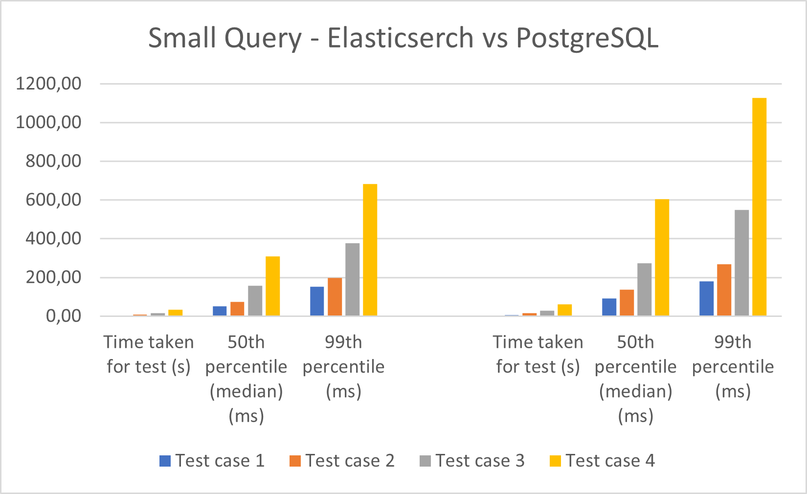
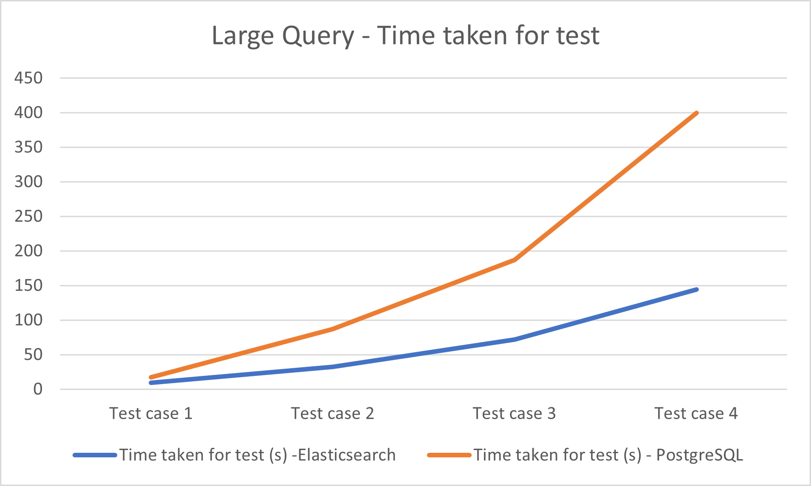
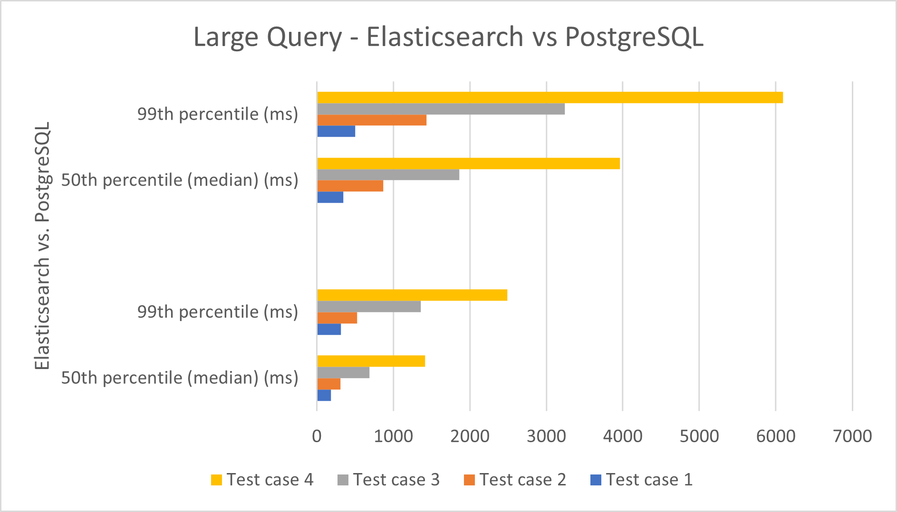

# Benchmark report: comparison of full-text search engine (Elasticsearch) and relational DB (PostgreSQL)

Faculty of Informatics and Digital Technologies

Author: Deni Kernjus

This benchmark report aims to provide a more in-depth comparison between full-text search and relational databases, specifically between Elasticsearch and PostgreSQL.

**PostgreSQL** is a relational database management system (RDBMS) focusing on ACID compliance and SQL support. It excels in structured data handling, complex queries, and transactional data. Uses SQL and is known for its reliability and robust performance in transactional systems. It is ideal for applications requiring complex data relationships and data integrity.

**Elasticsearch** is a search engine based on the Lucene library, primarily used for full-text search and analytics. It is optimized for search-intensive operations, particularly where speed and scalability for large volumes of unstructured data are crucial. It uses a JSON-based query language suitable for search queries and stands out for its rapid search responses and handling of large datasets. It is preferred for log analysis, real-time analytics, and applications where search functionality is a primary requirement.

## System Architecture

To perform tests, a small application is created using the following technologies:
- [**Flask**](https://flask.palletsprojects.com/en/3.0.x/): lightweight and flexible web application framework for Python
- [**Htmx**](https://htmx.org/): a modern web development tool that allows you to access AJAX, CSS Transitions, WebSockets, and server-sent events directly in HTML, using attributes
- [**PostgreSQL**](https://www.postgresql.org/): open-source, advanced object-relational database management system (DBMS)
- [**Elasticsearch**](https://www.elastic.co/elasticsearch): powerful, open-source, distributed search and analytics engine designed for horizontal scalability, reliability, and easy management. It enables complex search capabilities across diverse types of data, and is widely used for log and event data analysis and full-text search
- [**Docker**](https://www.docker.com/): open-source platform that automates the deployment, scaling, and management of applications inside lightweight, portable containers
- [**Apache Bench**](https://httpd.apache.org/docs/2.4/programs/ab.html): a tool for benchmarking the performance of HTTP web servers

 

Using Docker-compose we create containers for:
- Main Flask application
- Flask application that contains Apache Bench for testing (Flask AB in the rest of the report)
- PostgreSQL
- Elasticsearch

The main Flask application contains endpoints for communication with end users from WEB, databases, and Flask AB. It loads data into databases, performs search queries, and requests testing of search queries from the Flask AB application.

Flask AB receives the URL and query to test, and Apache Bench sends that request back to the Main Flask application endpoint, which searches the database, and returns Apache Bench results.

## Data

Test cases are primarily focused on finding words or phrases in the database and measuring the time of response.

The dataset used for testing consists of 500,000 Uber reviews with columns:
- rb
- review_id
- pseudo_author_id
- author_name
- review_text
- review_rating
- review_likes
- author_app_version
- review_timestamp

Our focus is on column review_text, that is, finding words or phrases inside reviews.
This dataset was acquired from https://www.kaggle.com/datasets/bwandowando/1-5-million-uber-app-google-store-reviews and modified to suit our testing needs.

Although the length of the CSV file from which we are loading is 500,000 rows (reviews), we can choose how many reviews we want to load into databases.

**Important NOTE**:
Elasticsearch and PostgreSQL may yield different search results due to their inherent design and functionality. Elasticsearch, optimized for full-text search and analytics, uses inverted indices and relevance scoring to provide fast and efficient search capabilities, particularly for unstructured data. In contrast, PostgreSQL, a relational database system, excels in structured data queries using SQL. Its search results are based on exact matches and relational data models.

Because of this, test cases are performed for words or phrases that frequently result in the same number of returned rows from databases.

The limit for querying is set to 10,000 rows because that is the limit of Elasticsearch without implementing a more complex system. But that should be sufficient to represent the differences between Elasticsearch and PostgreSQL.

## Tests

The focus of this benchmark is to observe the response times of Elasticsearch and PostgreSQL while searching for a word in all review texts in databases and compare the results.

Tests are grouped into two categories: small query and large query. A small query tests the performance of a query that returns less than 1000 rows or documents, and a big query tests the performance of a query that returns more than 8000 rows or documents. Both Elasticsearch and PostgreSQL are loaded with 100,000 reviews. 

For each category, four test cases are performed:
- Test case 1: 
    - Total Requests: 100
    - Concurrency: 2
- Test case 2: 
    - Total Requests: 500
    - Concurrency: 5
- Test case 3: 
    - Total Requests: 1000
    - Concurrency: 10
- Test case 4: 
    - Total Requests: 2000
    - Concurrency: 20

Each test case is run three times, and here is presented the average of those.

Performance is evaluated based on measurements from the Apache Bench, specifically:
- **Time taken for test**: total time taken for test to complete
- **50th percentile (median)**: median response time (in ms), indicating that half of the requests were processed faster than this time and half were slower.
- **99th percentile**: percentile used to understand the experience of the slowest users, identifying worst-case scenarios

**Important NOTE**:
Tests are performed on the Manjaro Linux VM, and results may differ on another machine, but the conclusion should be the same.

### Small Query

Search word: PayPal
Elasticsearch returns 398 matches, and PostgreSQL returns 379.

Test case 1:
| mesurments    | Elasticsearch   | PostgrSQL   |
|:-------------|:-------------:|:-------------:|
| Time taken for test | 2.99 s | 4.93 s |
| 50th percentile (median) | 52 ms | 92 ms|
| 99th percentile | 153 ms | 180 ms|

Test case 2:
| mesurments    | Elasticsearch   | PostgrSQL   |
|:-------------|:-------------:|:-------------:|
| Time taken for test | 8.4 s| 14.65 s|
| 50th percentile (median) | 75 ms| 138 ms|
| 99th percentile | 198 ms | 269 ms|

Test case 3:
| mesurments    | Elasticsearch   | PostgrSQL   |
|:-------------|:-------------:|:-------------:|
| Time taken for test | 16.71 s| 28.690 s|
| 50th percentile (median) | 156 ms| 274 ms|
| 99th percentile | 377 ms| 548 ms|

Test case 4:
| mesurments    | Elasticsearch   | PostgrSQL   |
|:-------------|:-------------:|:-------------:|
| Time taken for test | 32.65 s| 62.36 s |
| 50th percentile (median) | 308 ms | 604 ms |
| 99th percentile | 683 ms| 1127 ms |

### Large Query

Search word: Driver
Elasticsearch returns 10,000 matches, and PostgreSQL returns 10,000.

Test case 1:
| mesurments    | Elasticsearch   | PostgrSQL   |
|:-------------|:-------------:|:-------------:|
| Time taken for test | 9.70 s | 17.64 s |
| 50th percentile (median) | 187 ms | 349 ms|
| 99th percentile | 316 ms | 499 ms|

Test case 2:
| mesurments    | Elasticsearch   | PostgrSQL   |
|:-------------|:-------------:|:-------------:|
| Time taken for test | 32.59 s| 87.15 s|
| 50th percentile (median) | 309 ms| 869 ms|
| 99th percentile | 527 ms | 1434 ms|

Test case 3:
| mesurments    | Elasticsearch   | PostgrSQL   |
|:-------------|:-------------:|:-------------:|
| Time taken for test | 72.15 s| 186.93 s|
| 50th percentile (median) | 688 ms| 1860 ms|
| 99th percentile | 1380 ms| 3240 ms|

Test case 4:
| mesurments    | Elasticsearch   | PostgrSQL   |
|:-------------|:-------------:|:-------------:|
| Time taken for test | 144.51 s| 399.65 s |
| 50th percentile (median) | 1417 ms | 3962 ms |
| 99th percentile | 2490 ms| 6095 ms |

## Conclusion

In Small query Elasticsearch is faster than PostgreSQL in all test cases, with times ranging from approximately 2.99 seconds to 32.65 seconds for Elasticsearch, compared to 4.93 seconds to 62.36 seconds for PostgreSQL. The median response time (50th percentile) is lower for Elasticsearch in all test cases, indicating that it processes over half of the requests more quickly than PostgreSQL. The 99th percentile times, representing the worst-case scenario for the slowest requests, are also better for Elasticsearch, suggesting it handles outliers more efficiently.

In Large query Elasticsearch again performs faster. As the query size increases, the gap in total time taken for the tests also increases, with Elasticsearch being about 1.8 to 3.5 times faster than PostgreSQL. Elasticsearch provides faster median response times, which grows notably as the test cases progress. The 99th percentile shows a substantial difference in response times, particularly in test case 4, where Elasticsearch's worst-case scenario is more than twice as fast as PostgreSQL's.

Conclusion is that Elasticsearch shows a clear advantage in search efficiency and speed compared to PostgreSQL, especially as the complexity and size of the queries increase. For applications where search performance is critical, especially involving large datasets, Elasticsearch appears to be the better-suited system based on these benchmarks.