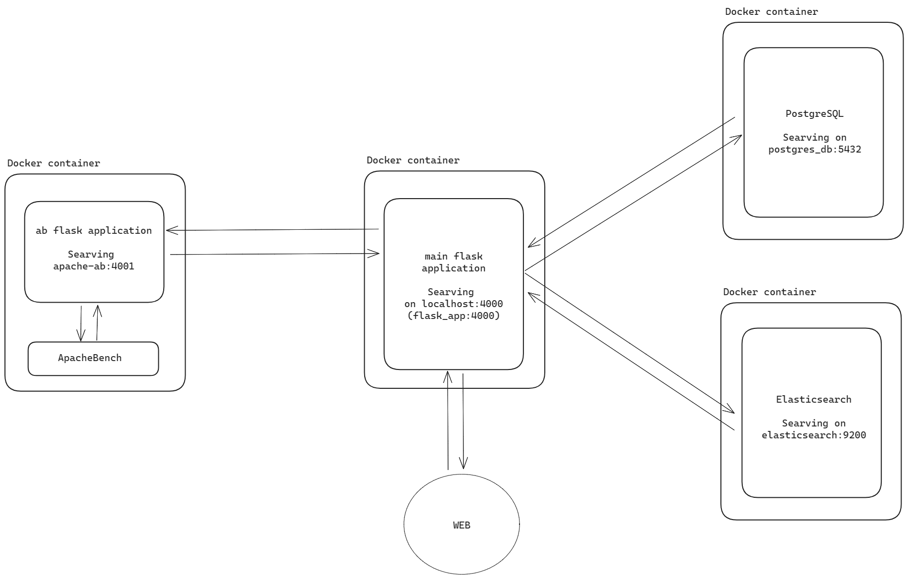

# Benchmark report: comparison of full-text search engine (Elasticsearch) and relational DB (PostgreSQL)

This benchmark report aims to provide a more in-depth comparison between full-text search and relational databases, specifically between Elasticsearch and PostgreSQL. 

**PostgreSQL** is a relational database management system (RDBMS) focusing on ACID compliance and SQL support. It excels in structured data handling, complex queries, and transactional data. Uses SQL and is known for its reliability and robust performance in transactional systems. It is ideal for applications requiring complex data relationships and data integrity.

**Elasticsearch** is a search engine based on the Lucene library, primarily used for full-text search and analytics. It is optimized for search-intensive operations, particularly where speed and scalability for large volumes of unstructured data are crucial. It uses a JSON-based query language suitable for search queries and stands out for its rapid search responses and handling of large datasets. It is preferred for log analysis, real-time analytics, and applications where search functionality is a primary requirement.

## System Architecture

To perform tests, a small application is created using the following technologies:
- [**Flask**](https://flask.palletsprojects.com/en/3.0.x/): lightweight and flexible web application framework for Python
- [**Htmx**](https://htmx.org/): a modern web development tool that allows you to access AJAX, CSS Transitions, WebSockets, and server-sent events directly in HTML, using attributes
- [**PostgreSQL**](https://www.postgresql.org/): open-source, advanced object-relational database management system (DBMS)
- [**Elasticsearch**](https://www.elastic.co/elasticsearch): powerful, open-source, distributed search and analytics engine designed for horizontal scalability, reliability, and easy management. It enables complex search capabilities across diverse types of data, and is widely used for log and event data analysis and full-text search
- [**Docker**](https://www.docker.com/): open-source platform that automates the deployment, scaling, and management of applications inside lightweight, portable containers
- [**Apache Bench**](https://httpd.apache.org/docs/2.4/programs/ab.html): a tool for benchmarking the performance of HTTP web servers

 

Using Docker-compose we create containers for:
- Main Flask application
- Flask application that contains Apache Bench for testing (Flask AB in the rest of the report)
- PostgreSQL
- Elasticsearch

The main Flask application contains endpoints for communication with end users from WEB, databases, and Flask AB. It loads data into databases, performs search queries, and requests testing of search queries from the Flask AB application.

Flask AB receives the URL and query to test, and Apache Bench sends that request back to the Main Flask application endpoint, which searches the database, and returns Apache Bench results.

## Data

Test cases are primarily focused on finding words or phrases in the database and measuring the time of response.

The data used for testing consists of 500,000 Uber reviews with columns:
- rb
- review_id
- pseudo_author_id
- author_name
- review_text
- review_rating
- review_likes
- author_app_version
- review_timestamp

Our focus is on column review_text, that is, finding words or phrases inside reviews.
This dataset was acquired from https://www.kaggle.com/datasets/bwandowando/1-5-million-uber-app-google-store-reviews and modified to suit our testing needs.

Although the length of the CSV file from which we are loading is 500,000 rows (reviews), we can choose how many reviews we want to load into databases.

**Important NOTE**:
Elasticsearch and PostgreSQL may yield different search results due to their inherent design and functionality. Elasticsearch, optimized for full-text search and analytics, uses inverted indices and relevance scoring to provide fast and efficient search capabilities, particularly for unstructured data. In contrast, PostgreSQL, a relational database system, excels in structured data queries using SQL. Its search results are based on exact matches and relational data models.

Because of this, test cases are performed for words or phrases that frequently result in the same number of returned rows from databases.

The limit for querying is set to 10,000 rows because that is the limit of Elasticsearch without implementing a more complex system. But that should be sufficient to represent the differences between Elasticsearch and PostgreSQL.